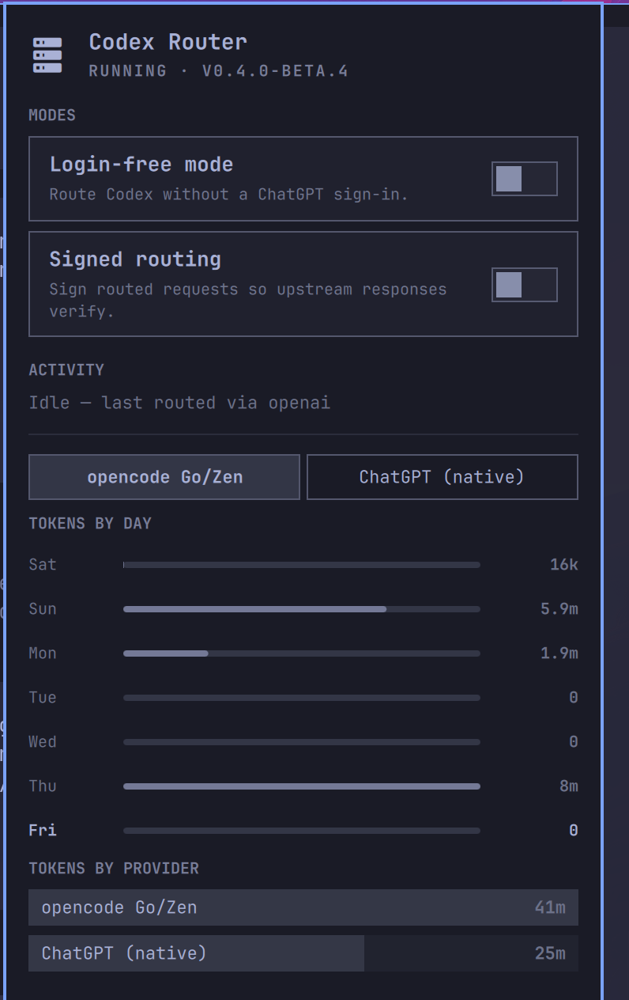
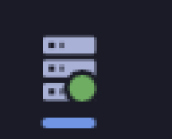
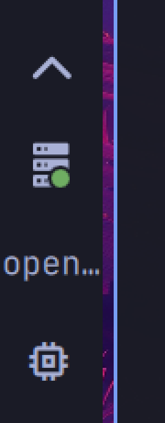
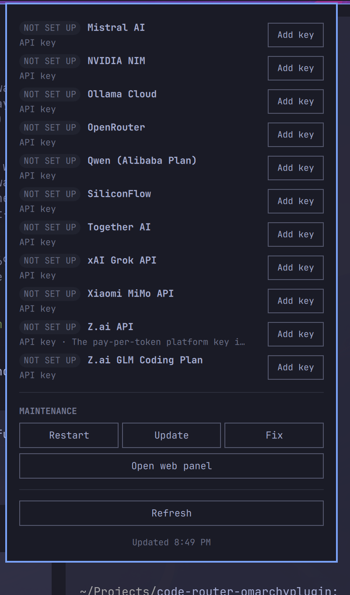

# Codex Router Tray

Native [Omarchy](https://omarchy.org) shell bar widget for
[codex-router](https://github.com/duolahypercho/codex-router): live router
status, usage, provider controls, and maintenance — replacing the Tauri/Electron
desktop companion on Linux. No second runtime, no Rust toolchain; just QML
inside the Omarchy shell (Quickshell).

Plugin id: `kzagoris.codex-router-tray` · License: MIT



## What you get

**Bar pill** — a router glyph with a status dot that reads at a glance:

| Dot | Meaning |
|---|---|
| green | running, idle |
| amber (pulsing) | generating — requests in flight |
| red | degraded or error state |
| gray | router offline / unreachable |

Optional label shows the provider currently handling traffic.



On left/right (vertical) bars the widget stacks one icon-slot per line, like
the clock:



**Panel** (left click) — one scrolling column, agents-style:

- **Hero** — live state line (`RUNNING · V0.4.0-BETA.4`, `GENERATING · 2 ACTIVE`, `OFFLINE`, `DEGRADED: …`)
- **Status box** — honest guidance when something is wrong (offline, caller key missing, degraded providers)
- **Modes** — login-free mode and signed routing toggles
- **Activity** — active provider/model/session and concurrent requests with elapsed time
- **Usage** — per-provider tokens by day (7-day bars) and by provider (share rows); optional ChatGPT quota cards
- **Providers** — every catalog provider with configured badge and enable/disable toggle; "Add key" / "Sign in" hand off to the router's own web panel
- **Maintenance** — restart service, update, `doctor --fix`, open web panel, refresh



**Middle click** opens the router's browser panel at its capability URL — the
escape hatch for heavy flows (provider credentials are never typed into the
plugin; the web panel is the router's sanctioned surface for secrets).

## Requirements

- Omarchy 4.x (Quattro shell / Quickshell)
- **codex-router installed and running** — payload shapes verified against
  v0.4.0-beta.4; start it with `systemctl --user start codex-router`
- **Node.js on PATH** — mutations spawn the router's control CLI
  (`node …/src/control.mjs`)
- Router's caller secret at `~/.codex/codex-router/caller-secret` (the router
  creates it; `./bin/doctor --fix` restores it if lost)

## Install

Copy/symlink this plugin folder into your plugins directory and enable it:

```sh
ln -s "$(pwd)/plugin" ~/.config/omarchy/plugins/kzagoris.codex-router-tray
omarchy plugin enable kzagoris.codex-router-tray right
```

(For a production install without a symlink, copy the folder instead — the
marketplace disallows symlinks.)

## Settings

Per-widget settings live in `~/.config/omarchy/shell.json`, in the widget's
layout entry:

```json
{ "id": "kzagoris.codex-router-tray", "port": 4202 }
```

| Key | Default | Description |
|---|---|---|
| `healthIntervalSec` | `4` | Health poll interval (2–60) |
| `dataIntervalSec` | `30` | Usage data refresh interval while readable (15–600) |
| `showProviderText` | `"Icon only"` | Bar label: `"Icon only"` or `"Provider name"` |
| `port` | `4202` | Router port override. Unset = `MODEL_ROUTER_PORT` env → `4202` |
| `stateDir` | `""` | State dir holding `caller-secret`. Unset = `~/.codex/codex-router` |
| `sourceRoot` | `""` | Router checkout for the control CLI. Unset = `~/.local/share/codex-router` |
| `accountUsage` | `"Off"` | ChatGPT quota cards. The upstream call is slow; off by default |

## IPC

```sh
omarchy-shell shell summon kzagoris.codex-router-tray '{}'   # open
omarchy-shell shell hide kzagoris.codex-router-tray          # close
omarchy-shell shell toggle kzagoris.codex-router-tray
omarchy-shell shell refresh kzagoris.codex-router-tray
```

With the panel focused, `R` refreshes, Escape closes, Tab switches panels.

## How it works

- `GET http://127.0.0.1:<port>/health` — unauthenticated, cheap, drives dot +
  hero + activity.
- `POST /_codex-router/<caller-secret>/panel/invoke` — the same bridge the
  router's browser panel injects, restricted to the read-only allowlist
  (`control_snapshot`, `account_usage`, `provider_usage`, `provider_setup`,
  `local_models`). The caller secret is read once into memory and never
  logged, stored, or echoed; URLs containing it are redacted.
- Mutations run the router's own CLI (`src/control.mjs` with
  `MODEL_ROUTER_TARGET=codex`), serialized with busy/error feedback, each
  followed by a fresh read ("mutate, then re-read").

All traffic is loopback-only. No credentials ever flow through the plugin.

## Troubleshooting

| Symptom | Fix |
|---|---|
| Gray dot, "Router offline" | `systemctl --user start codex-router` |
| "Caller key missing or unreadable" | `./bin/doctor --fix` in the router checkout |
| Toggles/buttons error | Check Node is on PATH and `sourceRoot` points at the router checkout |
| Widget missing from the gallery | `omarchy plugin list --json | jq 'select(.id=="kzagoris.codex-router-tray")'` |
| QML errors in the journal | `qs log -p "$OMARCHY_PATH/shell" --tail 100` |

## Development

```sh
./scripts/lint.sh        # Qt6 qmllint with the shell's import paths
./sync.sh                # copy plugin/ into ~/.config/omarchy/plugins/
omarchy plugin validate ~/.config/omarchy/plugins/kzagoris.codex-router-tray
```

Body edits inside an already-compiling QML file hot-reload on save; import or
new-file changes need `omarchy restart shell`.

## Out of scope, on purpose

- macOS-style Dynamic Island overlay (Linux tray has no island either)
- Local model pull/install flows with progress streaming (link out to the web panel)
- i18n — English only

## License

MIT — see [LICENSE](LICENSE).
