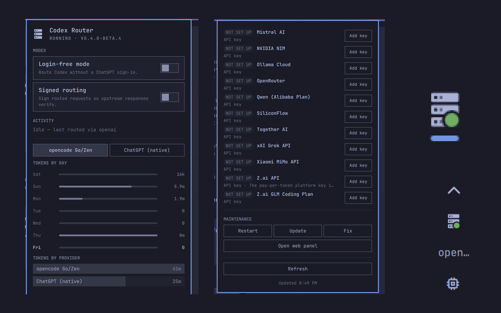
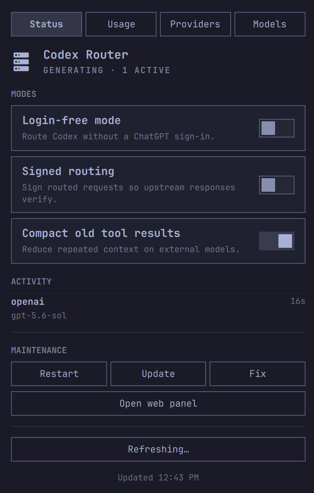
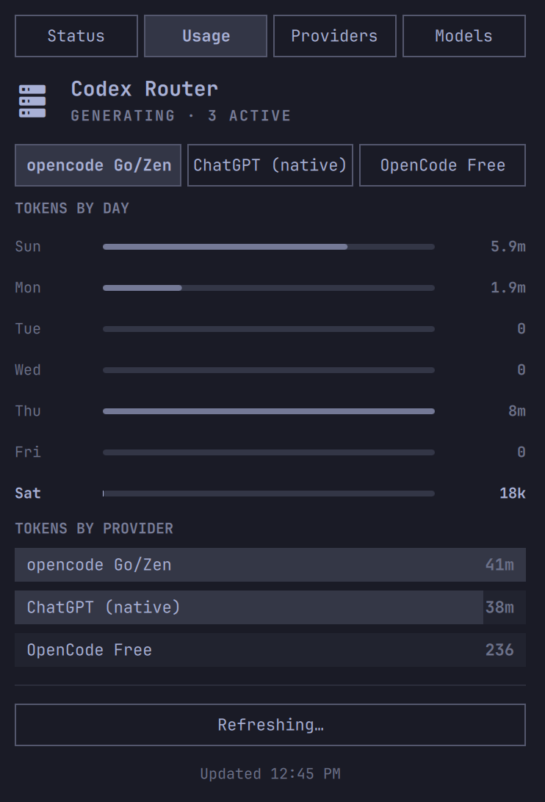
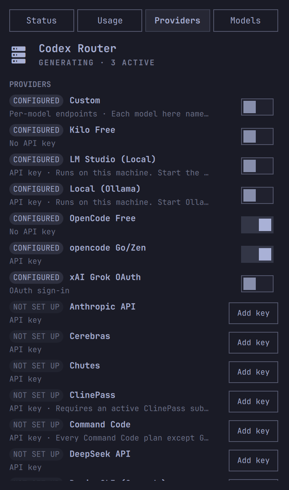
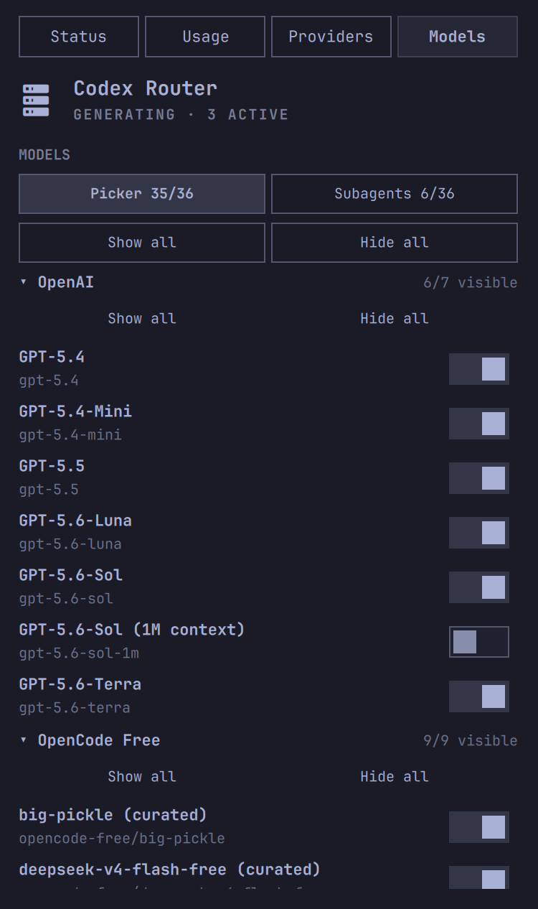

# Codex Router Tray

Codex Router Tray is a bar widget for the [Omarchy](https://omarchy.org)
shell. It shows the status of
[codex-router](https://github.com/duolahypercho/codex-router), its usage, its
providers, and its models. It also gives you the maintenance commands.

The widget replaces the Tauri desktop companion on Linux. It adds no second
runtime and no Rust toolchain. The code is QML inside the Omarchy shell
(Quickshell).

Plugin id: `kzagoris.codex-router-tray` · Version 0.5.2 · License: MIT

<p align="center">
  
</p>

## What you get

**The bar pill** shows a router glyph with a status dot. The color of the dot
gives the state of the router.

| Dot | Meaning |
|---|---|
| green | The router runs and is idle. |
| amber (it pulses) | The router routes one or more active requests. |
| red | The router is degraded, or it has an error. |
| gray | The router is off, or the widget cannot get access to it. |

An optional label shows the provider that routes the traffic now. On a left
bar or a right bar, the widget puts one icon in each line, like the clock.

**The panel** opens with a left click. It has four views: Status, Usage,
Providers, and Models. Each view keeps the same three parts:

- **The hero line** shows the live state (`RUNNING · V0.4.0-BETA.4`,
  `GENERATING · 2 ACTIVE`, `OFFLINE`, or `DEGRADED: …`).
- **The status box** shows guidance when a problem occurs. The router is off,
  the caller key is absent, or a provider is degraded.
- **The footer** has a manual refresh button and the time of the last update.

The panel does not obey the single-column style of the first-party widgets.
This is deliberate. The catalog has 111 models from 19 providers. In one
scroll column, these rows make a column that is too long, and the usage data
and the controls go far below the models. The four views keep each part at a
length that you can read.

The shell keeps your selected view for the session. The view stays the same
after you close the panel and open it again. A shell restart sets the view
back to Status.

### Status

The Status view has the three modes of the router: login-free routing, signed
routing, and compaction of old tool results. Below the modes, it shows the
live activity and the maintenance commands: Restart, Update, Fix, and Open
web panel.

<p align="center">
  
</p>

### Usage

The Usage view shows the limits and the tokens of one provider. A switcher
selects the provider. A provider gets a position in the switcher when it
reports a limit, a balance, or traffic.

The view shows the limits, the funding, and the account notes of the selected
provider. Each limit shows the used part in percent and the time to the reset.
The bars below show the tokens for each of the last 7 days. The last rows show
the part of the total that each provider used.

<p align="center">
  
</p>

### Providers

The Providers view shows each provider in the catalog with a badge and a
toggle. The badge tells you if the provider is configured. The toggle turns
the provider on or off.

"Add key" and "Sign in" open the web panel of the router. You never type a
credential into the plugin.

<p align="center">
  
</p>

### Models

The Models view shows each model in the catalog that an enabled provider
gives. The rows are in groups by provider, and you can collapse each group.

A sub-switcher selects what the row toggle changes: the visibility in the
picker, or the eligibility as a subagent. Each label carries both counts.
Thus a click cannot change the wrong setting.

A picker row shows the slug of the model. A subagent row shows the proof:
`Proven v2`, `Untested`, `Working…`, or `Error: …`. Put the mouse pointer on
an error to see the reason from the router.

A model that is hidden from the picker cannot be a subagent. Its toggle is
inert, and the badge gives the cause. A click on that toggle moves you to the
Picker sub-view. The widget does not make the model visible without your
permission.

"Show all", "Hide all", "Subagents on", and "Subagents off" operate on the
full list or on one provider. They use the bulk verbs of the router: one
command, not one command for each model.

The toggles are optimistic. A toggle changes immediately, and repeated clicks
on the same model become one command. If a command fails, the toggle goes
back and the panel shows the message from the router. When the queue is
empty, the view reads the data one time and reconciles.

<p align="center">
  
</p>

**A middle click** opens the browser panel of the router at its capability
URL. Use it for the large flows. The web panel is the sanctioned surface of
the router for secrets.

## What you need

- Omarchy 4.x (Quattro shell / Quickshell).
- codex-router, installed and in operation. Start it with
  `systemctl --user start codex-router`. The payload shapes agree with
  v0.5.0.
- Node.js on the PATH. Mutations start the control CLI of the router
  (`node …/src/control.mjs`).
- The caller secret of the router at `~/.codex/codex-router/caller-secret`.
  The router makes this file. If the file is lost, `./bin/doctor --fix` makes
  it again.

## Install

Clone this repository into your plugins directory. Then turn on the plugin:

```sh
git clone https://github.com/kzagoris/codex-router-tray-omarchy-plugin.git \
  ~/.config/omarchy/plugins/kzagoris.codex-router-tray
omarchy plugin enable kzagoris.codex-router-tray right
```

To update the plugin later, do these two commands:

```sh
git -C ~/.config/omarchy/plugins/kzagoris.codex-router-tray pull
omarchy restart shell
```

The folder must be a real copy. A plugin folder must not contain a symlink.
`omarchy plugin validate` refuses a symlink, and the marketplace refuses it
too.

## Remove

Turn the plugin off, then delete its folder:

```sh
omarchy plugin disable kzagoris.codex-router-tray
rm -rf ~/.config/omarchy/plugins/kzagoris.codex-router-tray
omarchy restart shell
```

The plugin writes nothing outside that folder. Its settings live in the
widget entry in `~/.config/omarchy/shell.json`; delete that entry to remove
them. The plugin never changes the router, the caller secret or any file in
`~/.codex/`.

## Settings

The settings of the widget are in `~/.config/omarchy/shell.json`, in the
layout entry of the widget:

```json
{ "id": "kzagoris.codex-router-tray", "port": 4202 }
```

| Key | Default | Description |
|---|---|---|
| `healthIntervalSec` | `4` | Interval of the health poll in seconds (2 to 60) |
| `dataIntervalSec` | `30` | Interval of the usage refresh in seconds, while the widget can read the data (15 to 600) |
| `showProviderText` | `"Icon only"` | The bar label: `"Icon only"` or `"Provider name"` |
| `port` | `4202` | The port of the router. If it is empty, the widget uses `MODEL_ROUTER_PORT`, then `4202` |
| `stateDir` | `""` | The directory that holds `caller-secret`. If it is empty, the widget uses `~/.codex/codex-router` |
| `sourceRoot` | `""` | The checkout of the router for the control CLI. If it is empty, the widget uses `~/.local/share/codex-router` |

## Commands

```sh
omarchy-shell shell summon kzagoris.codex-router-tray '{}'   # open
omarchy-shell shell hide kzagoris.codex-router-tray          # close
omarchy-shell shell toggle kzagoris.codex-router-tray
omarchy-shell kzagoris.codex-router-tray refresh             # re-poll now
```

Put the focus on the panel. Then push `R` to refresh the data, Escape to
close the panel, or Tab to move to the next panel.

## How it works

- `GET http://127.0.0.1:<port>/health` needs no authentication and is cheap.
  It drives the dot, the hero line, and the activity.
- `POST /_codex-router/<caller-secret>/panel/invoke` is the same bridge that
  the browser panel of the router injects. The widget uses only the read-only
  allowlist: `control_snapshot`, `account_usage`, `provider_usage`,
  `provider_setup`, and `local_models`.
- The widget reads the caller secret one time into memory. It never writes
  the secret to a log or to a file, and it removes the secret from each URL
  that it shows.
- Mutations run the control CLI of the router (`src/control.mjs` with
  `MODEL_ROUTER_TARGET=codex`). The widget runs one command at a time and
  shows a busy label or an error. After each command, it reads the data
  again.
- The model toggles queue behind the same runner. Repeated intents for one
  model become one command. When the queue is empty, the view reconciles
  against one read. The bulk commands operate on the full list or on one
  provider.

All the traffic stays on the loopback interface. No credential goes through
the plugin.

## Problems and fixes

| Problem | Fix |
|---|---|
| The dot is gray and the panel shows "Router offline" | `systemctl --user start codex-router` |
| The panel shows "Caller key missing or unreadable" | Run `./bin/doctor --fix` in the checkout of the router |
| A toggle or a button gives an error | Make sure that Node is on the PATH and that `sourceRoot` points to the checkout of the router |
| The widget is absent from the gallery | `omarchy plugin list --json \| jq '.[] \| select(.id=="kzagoris.codex-router-tray")'` |
| The journal shows QML errors | `qs log -p "$OMARCHY_PATH/shell" --tail 100` |

## Changelog

Full history in [`CHANGELOG.md`](CHANGELOG.md).

### Unreleased

- **The limits show without a setting.** The `accountUsage` setting is
  removed. The Usage view reads the ChatGPT limits when you open it and when
  you refresh. A key that stays in `shell.json` does no harm; the widget
  ignores it (`scratch/011`).

- **The limits, the funding, and the notes belong to one provider.** The
  switcher scopes them, in this sequence: LIMITS, FUNDING, ACCOUNTS. The
  tokens for each provider stay a sum of all the providers (`scratch/011`).

### 0.3.0 — 2026-08-28

- **Router 0.5.0 alignment.** Proof badges follow the new lifecycle
  (`candidate` → "Probe passed — awaiting certification", `verified` →
  "Certified on this machine", plus legacy `experimental`/`proven` labels).
  Local proofs no longer claim registry `v2`, and degraded health names
  render as "Kimi OAuth forwarder · Grok OAuth forwarder · API forwarder ·
  Gateway" behind a "Degraded:" prefix — not "providers". Payloads and
  the `Proof` entry in `CONTEXT.md` are verified against 0.5.0
  (`scratch/003`, `scratch/006`).

- **Subagent modes are live and honest.** The mode toggle now reads "Every
  catalog model as a subagent" with the risk that it exposes routes that
  have never been shown to work. It writes `all`; turning it off writes
  `selected` when you have a selection, otherwise `proven`. Row state
  mirrors `applyMultiAgentSettings` (hidden/disabled → registry v2 → mode)
  so the panel and the spawn agree (`scratch/004`).

- **Repository-certified v1 cannot be a native v2 subagent.** Such rows
  show a disabled toggle and a badge that names the registry verdict.
  Picker visibility stays live. When a row is both hidden and v1, the
  picker interlock takes precedence (`scratch/005`).

- **Status view surfaces more 0.5 facts.** A dim caption shows
  `chatgptSession` sharing, session, and expiry (`~10d` / `30+ days`);
  another shows the router default catalog model. Picker rows carry a
  caption for synthesized native context variants ("Router-managed context
  variant") and free routes ("Free"). Captions never touch membership,
  counts, badges, or the interlock (`scratch/007`).

- **Usage view shows what funds the next request.** Generic quota windows
  (for example opencode Go "Rolling limit") keep the router sanitized
  label and draw a LIMITS card. `kind: "balance"` metrics render as a
  FUNDING section — value-only, meter only with a real `usedPercent`,
  "Unavailable" when `available: false`. `account.plan` and
  `account.message` render as a bounded ACCOUNT NOTES section. FUNDING and
  NOTES read `provider_usage` and `provider_setup` and show without the
  slow `account_usage` call; LIMITS (all quota windows) stays behind
  `accountUsage: On` (`scratch/008`).

### 0.2.0 — 2026-08-22

- **The Models view.** It shows each model in the catalog that an enabled
  provider gives, in groups by provider. A sub-switcher selects the picker
  visibility or the subagent eligibility. The view has proof badges, the
  interlock between the two settings, and the bulk commands.
- **The panel became a switcher over four views.** Status, Usage, Providers,
  and Models share one hero line, one status box, and one footer. The shell
  keeps the selected view for the session.
- **Optimistic toggles.** A click changes the toggle immediately. Repeated
  clicks on one model become one command. A failure puts the toggle back with
  the message from the router. The view then reconciles against one read.
- **Correct release of the automatic refresh.** Each exit from the mutation
  runner releases it, and this includes the abort when the router is off. A
  toggle whose read is still in transit stays when you leave the view.
- **The compaction of old tool results** moved into the modes in the Status
  view, where a routing mode belongs.
- The control CLI wrapper accepts a slug with a provider, for example
  `opencode-free/big-pickle`.

### 0.1.0 — 2026-08-21

The first public release. It has the bar pill with the live health dot. Its
panel has the modes, the activity, the usage, and the provider controls. The
panel also has the maintenance commands and the link to the web panel.

## Not included, on purpose

- An overlay in the style of the macOS Dynamic Island. The Linux tray has no
  island.
- Flows that install a local model and show the progress. The web panel does
  this.
- Other languages. The plugin is in English only.

## License

MIT — see [LICENSE](LICENSE).
